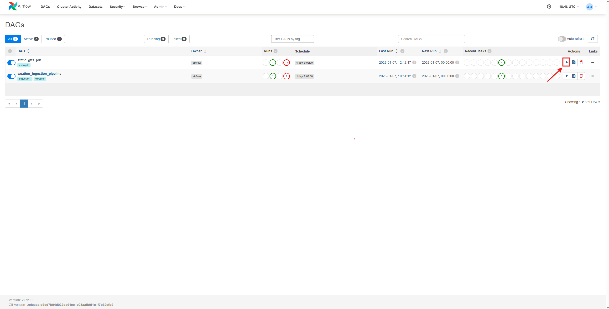

# Route optimisation based on demand

Team matcha - Introduction to Big Data Project

## ML Demand Prediction (Alexandra)

### What it does
- Uses the hourly aggregated dataset (`ml_dataset_hourly` view) built from:
  - passenger demand (mock passenger flow)
  - weather hourly features
  - realtime/service signals (if available)
- Trains a baseline regression model to predict passenger demand per route and hour.
- Writes predictions into PostGIS table: `demand_predictions`.

### Run order (required)
1) `static_gtfs_job` (creates GTFS data + stop_base_demand)
2) `weather_ingestion_pipeline`
3) `mock_passenger_flow_pipeline`
4) ML training + prediction

### How to run ML
```bash
docker compose up -d --build ml
docker exec -it gtfs-ml python src/ml/train_predict.py


## 🛠️ Creating a New Airflow Job (TaskFlow API) – Airflow 2.11.0

This guide explains **step by step** how to create a new Airflow job using the **TaskFlow API**, for the Docker-based setup described in PR #1 (Airflow 2.11, Kafka, PostGIS).

---

### 1️⃣ Create a New DAG File

Create a new Python file in the DAGs directory mounted into Airflow: `src/dag/my_new_job.py`
Airflow automatically discovers any `.py` file placed in this folder.

---

### 2️⃣ Minimal TaskFlow DAG Skeleton

Start with the smallest valid TaskFlow DAG:

```python
from datetime import datetime, timedelta
from airflow.decorators import dag, task

@dag(
    dag_id="my_new_job",
    start_date=datetime(2021, 1, 1),
    schedule=timedelta(days=1),
    catchup=False,
    tags=["example"],
)
def my_new_job():
    pass

my_new_job()
```

This is enough for the DAG to appear in the Airflow UI.

### 3️⃣ Define Tasks Using @task

Add tasks inside the DAG function:
```python
from datetime import datetime, timedelta
from airflow.decorators import dag, task
import logging

@dag(
    dag_id="my_new_job",
    start_date=datetime(2021, 1, 1),
    schedule=timedelta(days=1),
    catchup=False,
)
def my_new_job():

    @task
    def extract():
        logging.info("Extracting data")
        return {"value": 42}

    @task
    def transform(data: dict):
        logging.info("Transforming data")
        return data["value"] * 2

    @task
    def load(result: int):
        logging.info("Loading result: %s", result)

    extracted_result = extract()
    transformed_result = transform(extracted_result)
    load(transformed_result)

my_new_job()
```
Notes
 - No operators are required
 - Dependencies are inferred from function calls
 - Returned values are passed automatically (XCom)

 Store configuration in the Airflow UI:

### 4️⃣ Use Airflow Variables for Configuration

Admin → Variables


Read the variable inside a task:

from airflow.models import Variable
```python
@task
def read_config():
    return Variable.get("KAFKA_BOOTSTRAP_SERVERS")
```

### 6️⃣ Run and Test the DAG
Start the stack:
```bash
docker compose up -d
```

Open the Airflow UI: `http://localhost:8080`


Steps:
- Enable the DAG
- Trigger it manually

- Inspect logs for each task
